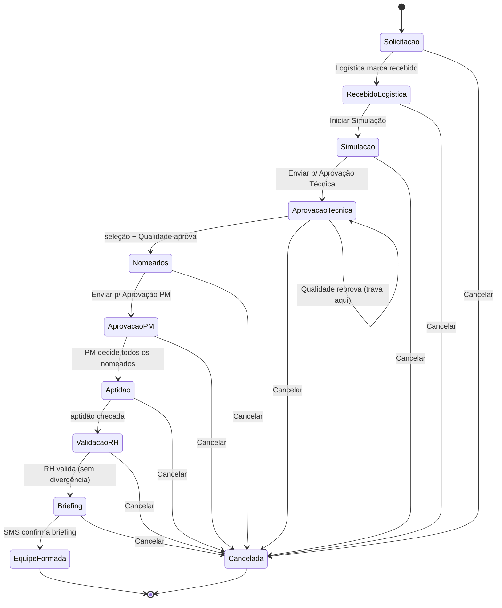
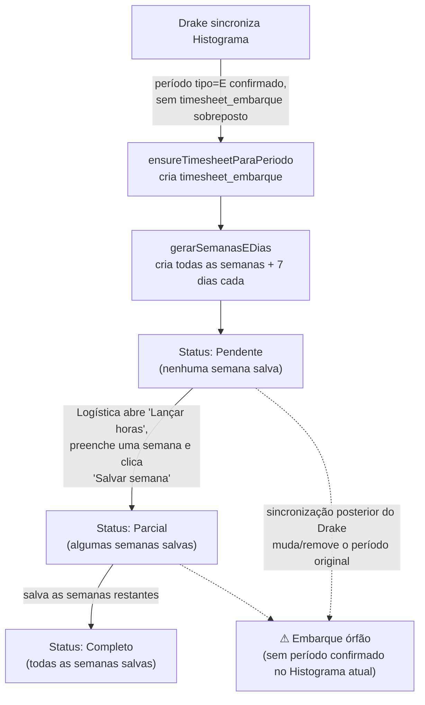
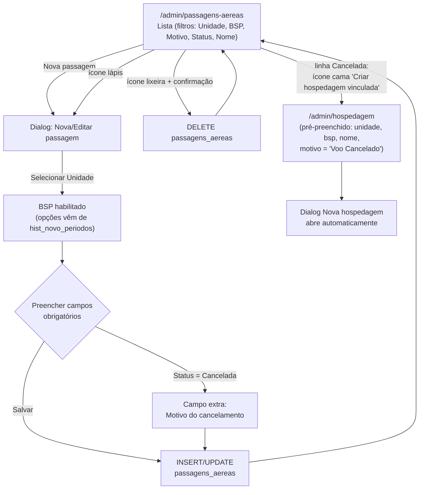
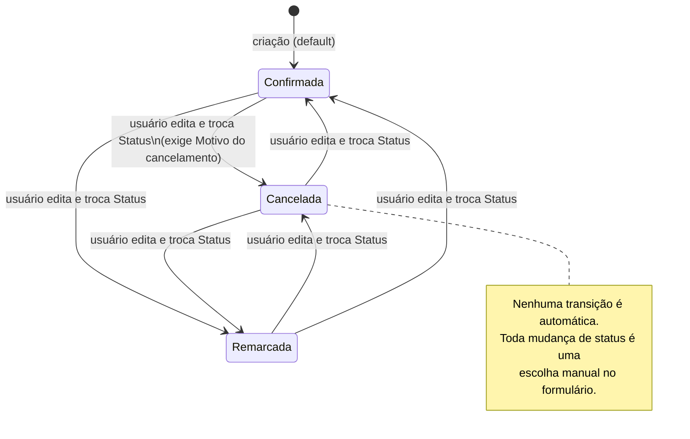
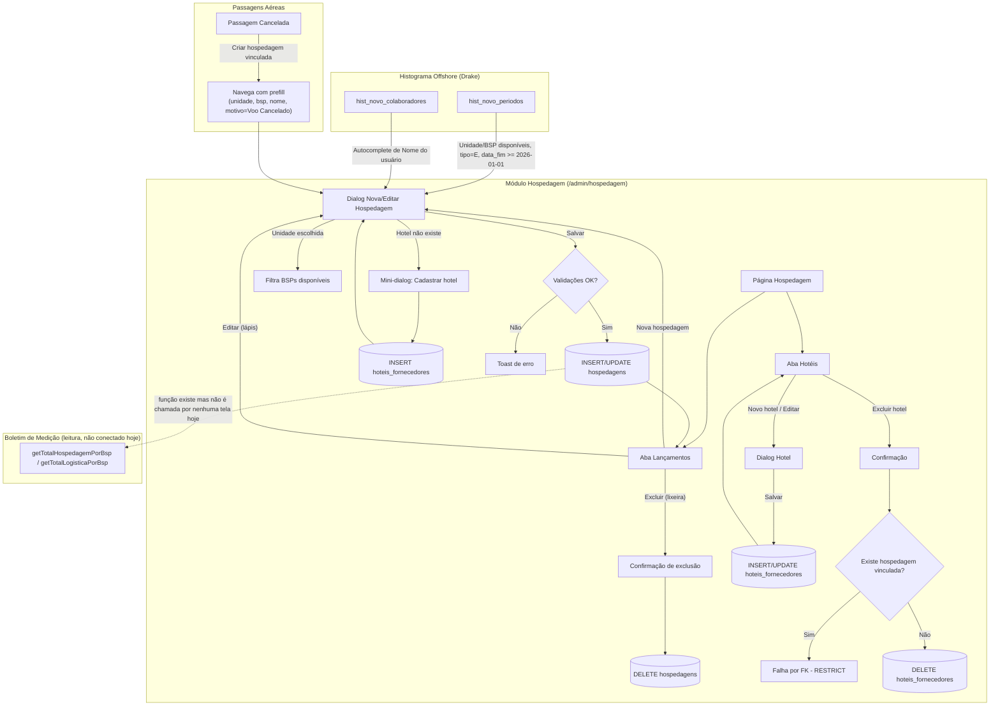
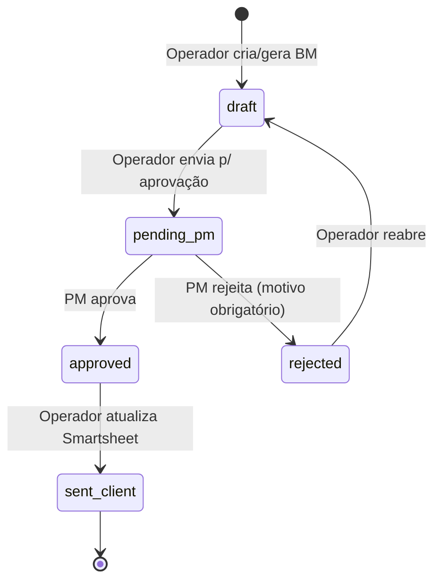
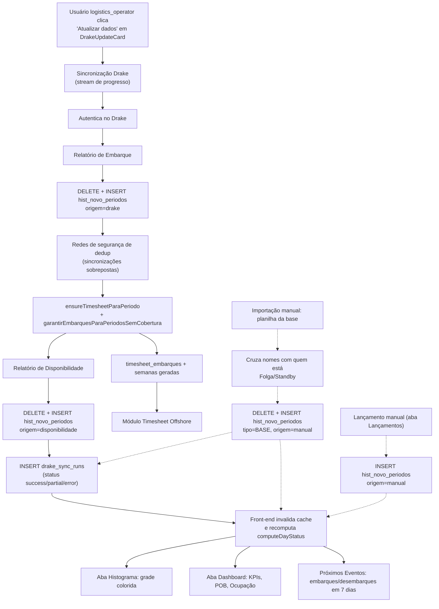

# Mapeamento — Step Time Hub

Levantamento técnico dos módulos do app, para documentação/fluxogramas. Gerado por leitura direta do código-fonte (rotas, componentes, migrations SQL) — nenhuma alteração foi feita na aplicação.

---

## Nomeações

### 1. Telas e rotas

| Tela | Rota | Quem acessa |
|---|---|---|
| Painel da Logística (kanban de 10 etapas) | `/admin/nominations` | `logistics_operator` (acesso total) e os 4 papéis de etapa (`aprovacao_tecnica`, `qualidade`, `rh`, `sms` — cada um só age na própria etapa, mas lê o board inteiro) |
| Minhas Solicitações (criar/acompanhar) | `/pm` | papel `pm` ("Solicitante") |
| BMs para Aprovar (módulo separado, mesma área) | `/pm/bms` | papel `pm` |

Dentro de `/admin/nominations` existem 4 abas internas (não são rotas separadas, são `Tabs` do mesmo componente `NominationsPage` em `src/routes/admin/nominations.tsx`):

- **Simulação** — grade de disponibilidade (herdada do Histograma Offshore) com um "modo recrutamento": ao clicar em "Iniciar Simulação" num card, a aba filtra pela função da solicitação e cada colaborador ganha um botão "Adicionar" que grava um `nomination_nominees`.
- **Nomeações** — o kanban de 10 colunas propriamente dito (`KanbanBoard`, drag-and-drop via `@dnd-kit`).
- **Aptidão** — duas sub-abas: "Pendentes de Nomeação" (checklist por nomeado, específico do fluxo de nomeação) e "Matriz de Qualificação" (`QualificationEligibilityTab`, consulta ampla de aptidão/cursos sincronizados do Drake para qualquer colaborador/função/período, não amarrada a uma nomeação específica).
- **Configurações** — CRUD de Tipos de Solda (`weld_type_config`) e Materiais de Solda (`weld_material_config`).

Ao clicar num card do kanban abre um `Dialog` (`ManageDialog`) com 3 sub-abas: **Detalhes**, **Etapa atual** (ação específica da etapa em que o card está) e **Histórico**.

### 2. Campos e formulários

**Criação da solicitação** (só pelo Solicitante, em `/pm`, `CreateDialog`):

| Campo | Obrigatório | Origem |
|---|---|---|
| Função | Sim | `SearchableSelect` com busca — opções vêm de `colaborador_funcoes_historico.funcao` ∪ `hist_novo_colaboradores.funcao`/`funcao_operacao` |
| Quantidade | Sim (padrão 1) | manual |
| Tipo de solda | Só se função é de Soldador (`isSoldador()`) | `weld_type_config` |
| Material de solda | Só se função é de Soldador — cascata: só habilita depois de escolher o Tipo de solda | `weld_material_config` |
| Unidade | Sim | `hist_novo_periodos.unidade_operacional` ∪ lista fixa `UNIDADES_OPERACIONAIS_FIXAS` |
| BSP | Sim — cascata: só habilita depois de escolher Unidade | `bspOptionsForUnidade()`, filtrando `hist_novo_periodos` pela unidade |
| Data início / fim | Não | manual |
| Projeto, Cliente, Observações | Não | manual |

`requires_quality_validation` é calculado automaticamente (não é um campo do formulário): `true` se o Tipo de solda escolhido tiver `weld_type_config.requires_quality_validation = true`.

**Cada etapa do kanban** tem seu próprio mini-formulário/ação (ver seção 5).

### 3. Tabelas do banco envolvidas

**`nominations`** (tabela principal) — colunas principais:
`id, created_at, updated_at, pm_user_id (FK auth.users), pm_name, funcao, quantidade, project, client, unidade, bsp, weld_type, weld_material, period_start, period_end, notes, current_status, requires_quality_validation, quality_status ('pendente'|'aprovado'|'reprovado'), quality_rejection_reason, quality_validated/_at/_by (legado, mantido como histórico de quem/quando decidiu), logistics_received_at/_by, briefing_sms_realizado(_at/_by), sequence_number, outcome ('concluida'|'cancelada'), cancel_reason, cancelled_at/_by`.
Campos legados `colaborador_id`/`colaborador_nome` (FK `hist_novo_colaboradores`) existem só por causa de um registro anterior à reformulação (a solicitação hoje é "N colaboradores", não 1).

**`nomination_nominees`** — um colaborador nomeado por linha:
`id, nomination_id (FK nominations, ON DELETE CASCADE), colaborador_id (FK hist_novo_colaboradores), colaborador_nome, is_active, technical_selected_at/_by, pm_decision ('pendente'|'aprovado'|'reprovado') + _at/_by, aptidao_checked(_at/_by), aptidao_divergence + _text + _flagged_at, rh_validated(_at/_by), created_at`.

**`nomination_status_history`** — log de eventos: `id, nomination_id, nominee_id (FK opcional), status, changed_by_name, changed_at, notes`.

**`weld_type_config`**: `id, weld_type_name, requires_quality_validation, created_at`.
**`weld_material_config`**: `id, material_name, created_at` (seed: Inox, Cobre, Cobre Níquel, Aço Carbono, Duplex, Super Duplex).

Relacionamentos: `nominations 1—N nomination_nominees`, `nominations 1—N nomination_status_history`, `nomination_nominees 1—N nomination_status_history` (via `nominee_id`), `nomination_nominees.colaborador_id → hist_novo_colaboradores.id`.

### 4. Regras de negócio no código

Toda a lógica de transição vive em `canMoveToColumn()` (`src/lib/nominations.ts`) — bloqueia **avanço**, nunca bloqueia retroceder:

- **Sair de Aprovação Técnica**: só se `requires_quality_validation = false` OU `quality_status = 'aprovado'`. Se `quality_status = 'reprovado'`, mensagem específica ("a Qualidade reprovou").
- **Sair de Aprovação PM**: precisa que todos os nomeados ativos (`is_active`) tenham `pm_decision ≠ 'pendente'`, e pelo menos um `'aprovado'`.
- **Sair de Validação RH**: nenhum nomeado ativo aprovado pode estar com `aptidao_divergence = true`.

**RLS (banco)** reforça o mesmo desenho — cada papel de etapa só tem `UPDATE`/`ALL` em `nominations`/`nomination_nominees` **enquanto** `current_status` é exatamente a etapa dele (`aprovacao_tecnica`, `qualidade`, `rh`, `sms`); fora disso é só leitura. `logistics_operator` tem acesso total sempre. O Solicitante (`pm`) só lê/decide as próprias solicitações (`pm_user_id = auth.uid()`), e só pode fazer a transição estreita Aprovação PM → Aptidão depois de decidir todos os nomeados (`pm_nominations_advance_from_approval`).

**Retroceder etapa limpa o que foi marcado**: `computeRevertClearing()` — ao mover um card pra trás, tudo que foi marcado nas etapas puladas é resetado (nomeados adicionados na Simulação são apagados se o retrocesso passar dessa etapa; seleção da Aprovação Técnica, decisão do PM, checagem de Aptidão e validação do RH voltam ao estado inicial conforme o caso) — evita que o card volte mas continue "pré-preenchido".

**Atalhos só para a Logística** (`logistics_operator`), escondidos atrás de um menu "⋮" no card (não aparecem como botões visíveis, de propósito, para não expor durante apresentações):
- **Retroceder etapa** — para qualquer etapa anterior.
- **Avançar etapa (sem aguardar os demais)** — pula direto para qualquer etapa posterior, ignorando os gates acima.
- Decisão de Aprovação PM também pode ser feita pela Logística no lugar do Solicitante.

**Sequência do card concluído**: trigger `assign_nomination_sequence` no banco atribui `sequence_number` (sequência que nunca reinicia) na primeira vez que `current_status` vira `'equipe_formada'` — evita corrida entre dois operadores.

### 5. Fluxo entre etapas/status

10 status fixos, nesta ordem: `solicitacao → recebido_logistica → simulacao → aprovacao_tecnica → nomeados → aprovacao_pm → aptidao → validacao_rh → briefing_sms → equipe_formada`.

| De → Para | Disparado por | Quem |
|---|---|---|
| Solicitação → Recebido pela Logística | botão "Marcar recebido" | Logística |
| Recebido → Simulação | botão "Iniciar Simulação" (leva direto pra aba Simulação, modo recrutamento) | Logística |
| Simulação → Aprovação Técnica | botão "Enviar para Aprovação Técnica" | Logística |
| Aprovação Técnica → Nomeados | seleciona candidatos (`technical_selected_at`) + confirma (gate de Qualidade) | papel `aprovacao_tecnica` ou Logística |
| Nomeados → Aprovação PM | botão "Enviar para Aprovação PM" | Logística |
| Aprovação PM → Aptidão | decide aprovado/reprovado por nomeado + confirma (todos decididos) | Solicitante (via `/pm`) ou Logística |
| Aptidão → Validação RH | marca aptidão de cada nomeado aprovado + confirma | Logística (única com acesso a essa etapa hoje) |
| Validação RH → Briefing | valida aptidão de cada nomeado (ou sinaliza/resolve divergência) + confirma | papel `rh` ou Logística |
| Briefing → Equipe Formada (fim) | marca "Briefing realizado" | papel `sms` ou Logística |
| Qualquer etapa → Equipe Formada (cancelada) | botão "Cancelar solicitação" + motivo opcional | Logística |

### 6. Integrações e automações

- **E-mail a cada avanço de etapa** (`notifyStageAdvance`, `src/lib/nominationEmails.ts`): `to` = e-mails de quem tem o papel dono da nova etapa (via `user_roles` + `profiles`); `cc` = todos os `logistics_operator` + o Solicitante (resolvido por `pm_user_id → profiles.email`, com fallback pra `projects.email` por `pm_name`). Nunca bloqueia a troca de etapa se falhar (fire-and-forget com log de aviso).
- **E-mail de divergência de aptidão** (`notifyAptitudeDivergence`) — dedicado, vai pro papel `rh` + operadores, tanto ao sinalizar quanto ao marcar como corrigido.
- **E-mail de cancelamento** (`notifyCancellation`) — assunto/corpo específicos ("CANCELADA"), vai pro Solicitante + operadores.
- **E-mail de reprovação de Qualidade** (`notifyQualityRejection`) — vai pro Solicitante + operadores.
- Todos os e-mails usam `sendNominationPhaseEmail` (server function) → `sendEmail` (nodemailer, credenciais SMTP via `.env`, nunca expostas ao browser).
- Sem edge functions dedicadas — todo o backend é server functions do TanStack Start.
- A aba "Matriz de Qualificação" **consome** dados já sincronizados do Drake pelo módulo de Histograma/Qualificação (tabelas `drake_qualification_*`), mas não dispara sincronização por si — só lê.

---

## Timesheet Offshore

### 1. Telas e rotas

Rota única `/admin/timesheet-offshore` (`src/routes/admin/timesheet-offshore.tsx`), com 2 abas internas:

- **Lançamento por período** (`EmbarquesTab`) — lista todos os embarques com lançamento de horas, filtros (De/Até, Unidade, BSP, Colaborador), pastilhas de atalho por Unidade, botão "Últimas Atualizações" (popover com os lançamentos salvos mais recentes) e "Novo Embarque" (criação manual).
- **Timesheets Pendentes** (`PendenciasTab`) — mesma listagem, mas só embarques com `status_entrega ≠ 'completo'`, com colunas de progresso (semanas recebidas / total esperado).

Ao clicar em "Lançar horas" (ícone de relógio) em qualquer linha, abre um `Dialog` full-width com `EmbarqueTimesheetPanel`: lista de "Semanas lançadas" daquele embarque (uma linha por semana, com "Salva"/pendente) + a grade de 7 dias da semana selecionada (evento, BSP, entrada/saída, horas normais/extras, HE entrada/saída, total).

Outros dialogs: "Novo Embarque" (`NovoEmbarqueDialog`), "Editar Embarque" (`EditarEmbarqueDialog`), confirmação de exclusão.

### 2. Campos e formulários

**Novo Embarque** (manual, `NovoEmbarqueDialog`): Colaborador (autocomplete de `hist_novo_colaboradores`), Unidade, BSP (cascata — só habilita depois da Unidade, opções via `bspOptionsForUnidade` sobre `hist_novo_periodos`), Função de embarque (lista fixa `FUNCOES_EMBARQUE` ou a função do colaborador), Data início/fim.

**Grade de lançamento diário** (por dia, dentro de `EmbarqueTimesheetPanel`):

| Campo | Obrigatório | Origem |
|---|---|---|
| Evento | Não (nasce "Embarque" ou "Dobra" automaticamente) | `EVENTOS_DIA`: Embarque, Desembarque, Dobra, Hotel Pré Embarque, Hotel Embarque Cancelado, Embarque Cancelado, Trabalho Externo |
| BSP (por dia) | Não — herda do embarque, mas é editável dia a dia (permite "lançamento quebrado" numa BSP diferente) | manual |
| Entrada / Saída | Não | manual (hora) |
| HE Entrada / HE Saída (hora extra) | Não | manual (hora) |
| Horas Normais / Horas Extras | Calculadas automaticamente a partir dos horários acima (`computeDuracaoHoras`), mas editáveis manualmente | calculado + override manual |
| Adicional Noturno | Sugerido automaticamente (`suggestAdicionalNoturno`) conforme horário cair na faixa noturna | calculado + override |

Botão "Salvar semana" marca `timesheet_semanas.recebido_fisico = true` e grava `data_recebimento`.

### 3. Tabelas do banco envolvidas

**`timesheet_embarques`**: `id, colaborador_id (FK hist_novo_colaboradores), periodo_id (FK opcional hist_novo_periodos — quase sempre NULL, ver seção 4), unidade_operacional, bsp, bsp_2 (segunda BSP quando o embarque é lançado parte numa BSP diferente), funcao_embarque, data_inicio_embarque, data_fim_embarque, status_entrega ('pendente'|'parcial'|'completo'), criado_em`.

**`timesheet_semanas`**: `id, embarque_id (FK timesheet_embarques), data_inicio_semana, data_fim_semana, recebido_fisico, data_recebimento, funcao_override (correção pontual só daquela semana), criado_em`.

**`timesheet_dias`**: `id, semana_id (FK timesheet_semanas), data, dia_semana, evento, bsp, descricao_tarefa, numero_tarefa, hora_entrada/_saida, hora_entrada_extra/_saida_extra, horas_normais, horas_extras, total_horas, adicional_noturno, feriado, criado_em`.

Relacionamento: `timesheet_embarques 1—N timesheet_semanas 1—N timesheet_dias` (cascata: um embarque de N dias gera **todas** as semanas de calendário segunda-a-domingo que tocam esse intervalo, cada semana com 7 linhas de dia — inclusive os dias fora do embarque, que nascem em branco).

**Tabelas lidas (só leitura)**: `hist_novo_colaboradores`, `hist_novo_periodos` (para a cascata Unidade→BSP e para o cálculo de "dias faltando"/"embarque órfão", ver seção 4).

### 4. Regras de negócio no código

**Geração automática a partir do Histograma** (`ensureTimesheetParaPeriodo` + `gerarSemanasEDias`, `src/lib/timesheetAutoGen.ts`, chamado pela importação do Drake em `src/lib/histograma/import-drake.ts`): para cada período confirmado de Embarque (`tipo='E'`, `origem ≠ 'programado'`) no Histograma, se **não existir já** um `timesheet_embarque` do mesmo colaborador com datas sobrepostas, cria um novo embarque + gera todas as semanas de calendário cobrindo o intervalo, com os 7 dias de cada semana (dias fora do embarque nascem em branco). Evento nasce "Embarque" nos primeiros 14 dias e "Dobra" a partir do 15º. `periodo_id` fica **sempre NULL de propósito** — o Drake apaga e reimporta as linhas de período a cada sincronização (IDs novos toda vez), então o dedup é por sobreposição de datas, não por FK.

**Duração "placeholder" do Drake**: se o Drake exportar um embarque ainda em aberto com uma data de fim muito distante no futuro (>90 dias de duração), o sistema gera semanas/dias só até hoje — nunca lança um dia que ainda não aconteceu.

**Embarque "órfão"** (achado nesta sessão, corrigido com um aviso — não some automaticamente): como a geração é só aditiva (nunca reconciliada depois), se uma sincronização do Drake posterior reclassificar ou mover aquele período, o `timesheet_embarque` já criado (e possivelmente já com horas salvas) fica sem nenhum período de Embarque confirmado correspondente no Histograma atual. `embarqueOrfaoDoHistograma()` sinaliza esses casos com um alerta visual — não apaga nada automaticamente, porque pode haver horas reais já lançadas.

**"Dias faltando"** (`diasFaltandoNoHistograma`): compara os dias marcados como Embarcado no Histograma (ano vigente) contra os dias que já têm `horas_normais` salvas — avisa quando falta lançar algo.

**RLS**: só `logistics_operator` tem acesso (`operators_timesheet_*_all`, `FOR ALL`) às três tabelas — não há papel de etapa como em Nomeações; é um módulo de uso exclusivo da Logística.

### 5. Fluxo entre etapas/status

Não é um kanban de aprovação — é um fluxo de **completude de lançamento**, derivado (não gravado diretamente pelo usuário): `status_entrega` é calculado (`computeStatusEntrega`) a partir de quantas semanas do embarque já têm `recebido_fisico = true` vs. o total de semanas esperadas (`totalSemanasEsperadas`).

| Status | Condição |
|---|---|
| **Pendente** | nenhuma semana com `recebido_fisico = true` |
| **Parcial** | algumas semanas salvas, mas não todas |
| **Completo** | todas as semanas esperadas do embarque estão salvas |

### 6. Integrações e automações

- **Sem e-mails** disparados por este módulo.
- **Cascata automática do Drake**: toda sincronização do Histograma Offshore roda `ensureTimesheetParaPeriodo` (novos períodos) e uma rede de segurança `garantirEmbarquesParaPeriodosSemCobertura` (cobre períodos "E" confirmados que ficaram sem embarque, mesmo de sincronizações antigas) — é a única automação relevante do módulo.
- **Importação de PDF**: existe um fluxo de leitura de PDFs de timesheet físico escaneado (`pdfExtractData`, mencionado no código) para preencher horas em lote — não aprofundado neste levantamento.
- **Sem edge functions** dedicadas.

---

## Passagens Aéreas

### 1. Telas e rotas

O módulo é uma única tela (não tem sub-rotas nem abas internas), acessível apenas a usuários com papel `logistics_operator` (escondida do menu para os papéis `visitante` e das etapas de aprovação de Nomeações — `src/routes/admin/route.tsx:19,31,36-37`).

| Tela | Rota | Arquivo |
|---|---|---|
| Passagens Aéreas (lista + filtros + cadastro) | `/admin/passagens-aereas` | `src/routes/admin/passagens-aereas.tsx:35` |
| Dialog "Nova passagem / Editar passagem" (dentro da mesma tela) | — (modal) | `src/routes/admin/passagens-aereas.tsx:89-233` (`PassagemDialog`) |
| Dialog de confirmação "Excluir passagem?" | — (modal) | `src/routes/admin/passagens-aereas.tsx:478-496` |

Não existe rota espelho no lado `pm` nem sub-diretório próprio — é tudo dentro do arquivo único `passagens-aereas.tsx`.

**Navegação de saída**: ao marcar uma passagem como "Cancelada" e clicar no ícone de cama (`BedDouble`), o usuário é levado para `/admin/hospedagem` com query params de pré-preenchimento (`passagens-aereas.tsx:325-330`), que abre automaticamente o formulário de "Nova hospedagem" já preenchido lá (`hospedagem.tsx:342-343,700-711`).

### 2. Campos e formulários

Formulário único (`PassagemDialog`), usado tanto para criar quanto para editar:

| Campo | Obrigatório | Origem do dado |
|---|---|---|
| Unidade | Sim | Lista fixa `UNIDADES_OPERACIONAIS_FIXAS` unida com as unidades vistas em `hist_novo_periodos` (Drake/Histograma) |
| BSP | Sim | Calculado a partir de `hist_novo_periodos` filtrado pela unidade escolhida, via `bspOptionsForUnidade` — desabilitado até a Unidade ser escolhida |
| Nome do usuário | Sim | Texto livre com autocomplete de `hist_novo_colaboradores.nome` (`NomeUsuarioField`) — não é FK, aceita qualquer nome digitado |
| Companhia aérea, Origem, Destino | Não | Manual (texto livre) |
| Data de ida | Sim | Manual |
| Data de volta | Não (passagem só de ida é permitida) | Manual |
| Tipo | Sim (default "Ida e Volta") | Select fixo: Ida / Ida e Volta / Remarcação |
| Valor | Sim | Manual (numérico) |
| Status | Sim (default "Confirmada") | Select fixo: Confirmada / Cancelada / Remarcada |
| Motivo | Não | Lista compartilhada `MOTIVOS_LOGISTICA` (Pré-Embarque, Voo Cancelado, Standby, Viagem, Curso, Outros) + "Outro (digitar)" |
| Motivo do cancelamento | Não, e **só aparece se Status = "Cancelada"** | Manual, condicional |
| Observações | Não | Manual |

Validação antes de salvar: Unidade, BSP, Nome do usuário, Data de ida e Valor são obrigatórios.

Filtros da listagem (não gravam nada): Unidade, BSP (dependente da Unidade), Motivo, Status, busca por Nome.

### 3. Tabelas do banco envolvidas

**`passagens_aereas`** (`supabase/migrations/20260729030000_passagens_aereas.sql`): `id, created_at, unidade, bsp, nome_usuario, companhia_aerea, origem, destino, data_ida, data_volta, tipo, valor NUMERIC(12,2), status DEFAULT 'Confirmada', motivo, motivo_cancelamento, observacoes`. Índices em `bsp`, `unidade`, `data_ida`. **Não há FK real** ligando a tabela a nenhuma outra — Unidade/BSP/Nome são só texto, sugeridos a partir de outras tabelas no momento do cadastro, sem constraint de integridade.

**Tabelas lidas (só leitura)**: `hist_novo_periodos` (tipo="E", alimenta as opções de Unidade/BSP) e `hist_novo_colaboradores` (autocomplete de nome).

**Relação com Hospedagem**: sem FK — só navegação (query params) quando uma passagem é cancelada.

### 4. Regras de negócio no código

- **RLS**: uma única policy, `operators_passagens_aereas_all`, `FOR ALL` restrita a `is_operator(auth.uid())` — sem distinção de permissão por status.
- **BSP dependente da Unidade**: desabilitado até escolher Unidade; trocar a Unidade limpa o BSP já escolhido.
- **"Motivo do cancelamento" condicional**: só aparece e só é gravado quando `status === "Cancelada"`; se o status for outro, o valor é forçado para `null` ao salvar.
- **"Criar hospedagem vinculada"**: o botão só aparece na linha quando `status === "Cancelada"` — o motivo pré-preenchido enviado para Hospedagem é sempre fixo, "Voo Cancelado".
- **Sem dedup automática**: cada "Nova passagem" é um INSERT independente, sem checagem de duplicidade contra o Drake.
- **Sobreposição de datas** (usada por `getTotalPassagensPorBsp`, não pela tela): quando não há `data_volta`, a própria `data_ida` é tratada como fim da viagem.

### 5. Fluxo entre etapas/status

**Não há esteira de aprovação/etapas** — é um CRUD "flat": qualquer operador pode criar, editar e excluir qualquer passagem a qualquer momento. Existe um campo `status` de três valores que o próprio usuário escolhe manualmente (não é um fluxo sequencial obrigatório — pode ir de qualquer valor para qualquer outro):

- **Confirmada** (default) — badge verde/neutro.
- **Remarcada** — badge cinza.
- **Cancelada** — badge vermelho; revela "Motivo do cancelamento" e habilita "Criar hospedagem vinculada".

Nenhuma automação promove/rebaixa o status sozinha — é 100% manual.

### 6. Integrações e automações

- **Nenhum e-mail** é disparado por este módulo (mudança de status é silenciosa, só toast local).
- **Sem Drake direto**: só leitura de `hist_novo_periodos`/`hist_novo_colaboradores` para sugerir Unidade/BSP/nome — nenhuma passagem é auto-criada a partir de um período de embarque (diferente do Timesheet Offshore).
- **Sem geração de PDF/Excel** própria.
- **Integração de custo definida mas desconectada**: `getTotalPassagensPorBsp`/`getTotalLogisticaPorBsp` (`src/lib/passagensAereas.ts`, `src/lib/logistica.ts`) somam passagens+hospedagem por BSP para alimentar uma linha "Logistics" do BM — mas **não são chamadas por nenhuma tela hoje**; o Step de Logística do BM usa `cost_logs`, não `passagens_aereas`. Vale confirmar com o time se é um recurso em andamento ou órfão.
- **Navegação cruzada com Hospedagem** (única automação "viva"): cancelar uma passagem leva para `/admin/hospedagem` com o formulário pré-preenchido.

---

## Hospedagem

### 1. Telas e rotas

Rota única `/admin/hospedagem` (`HospedagemPage`), acesso restrito a `logistics_operator` (fora do menu de "Visitante" e dos papéis de etapa de Nomeações; sem equivalente em `/pm/`), com 2 abas internas:

- **Lançamentos** (`LancamentosTab`) — filtros (Unidade, BSP, Hotel, Motivo, Nome), cards de total consolidado por BSP, tabela de hospedagens, dialog de criação/edição.
- **Hotéis** (`HoteisTab`) — CRUD do cadastro de hotéis fornecedores (`hoteis_fornecedores`).

**`HospedagemDialog`** — "Nova hospedagem"/"Editar hospedagem", aberto pelo botão "Nova hospedagem", pelo lápis em cada linha, ou automaticamente quando a página recebe parâmetros de prefill via querystring.

**`HotelCombobox`** — seleção de hotel dentro do dialog, com atalho "Cadastrar novo hotel" (mini-dialog inline).

**Entrada vinda de Passagens Aéreas**: uma passagem "Cancelada" tem um botão "Criar hospedagem vinculada" que navega para cá com `prefillUnidade/prefillBsp/prefillNome/prefillMotivo=Voo Cancelado` — a página lê via `validateSearch` e abre o dialog automaticamente já parcialmente preenchido, limpando a URL depois.

> Observação: existe uma tela "Hotel" completamente diferente em `/app/schedule.tsx` (Agenda do colaborador), lendo de uma tabela legada `hotel_bookings` — não tem relação com este módulo operacional; vale confirmar com o time se ainda está em uso.

### 2. Campos e formulários

**Dialog "Nova/Editar hospedagem"**:

| Campo | Obrigatório | Origem |
|---|---|---|
| Unidade | Sim | Lista fixa `UNIDADES_OPERACIONAIS_FIXAS` ∪ `hist_novo_periodos.unidade_operacional` |
| BSP | Sim | `bspOptionsForUnidade` sobre `hist_novo_periodos` (tipo="E"), dependente da Unidade |
| Nome do usuário | Sim | Texto livre com autocomplete de `hist_novo_colaboradores` — não é FK |
| Hotel | Sim | Combobox de `hoteis_fornecedores`, com cadastro rápido inline |
| Cidade | — (somente leitura) | Derivado do hotel selecionado |
| Check-in / Check-out | Sim | Manual — check-out precisa ser posterior ao check-in |
| Diárias | — (calculado) | `computeDiarias(checkIn, checkOut)` |
| Valor da diária | Manual (default 0) | Manual |
| Valor total | — (calculado) | `diárias × valor da diária` |
| Motivo | Não | `MOTIVOS_LOGISTICA` + "Outro (digitar)" |
| Observações | Não | Manual |

**Dialog "Novo/Editar hotel"**: Nome, Cidade, Estado (UF, 2 caracteres) — todos obrigatórios, sem integração Drake.

### 3. Tabelas do banco envolvidas

**`hoteis_fornecedores`**: `id, created_at, nome, cidade, estado` — pré-populada com 9 hotéis na própria migration.

**`hospedagens`**: `id, created_at, unidade, bsp, nome_usuario, hotel_id (FK hoteis_fornecedores, sem cascade — RESTRICT implícito), check_in, check_out, diarias (calculado na aplicação), valor_diaria, valor_total (calculado na aplicação), motivo, observacoes`. Índices em `bsp`, `unidade`, `check_in`.

**Tabelas lidas (só leitura)**: `hist_novo_periodos` (opções de Unidade/BSP, filtro tipo="E"), `hist_novo_colaboradores` (autocomplete de nome). Sem FK formal entre `hospedagens` e essas tabelas — ligação só por valor de texto.

### 4. Regras de negócio no código

- **RLS**: `operators_hoteis_fornecedores_all`/`operators_hospedagens_all` restritas a `logistics_operator` — sem acesso de leitura para `pm` ou `visitante` (diferente de `hist_novo_periodos`, que `pm` já pode ler).
- **BSP depende de Unidade**: desabilitado até escolher Unidade.
- **Diárias e Valor total nunca são digitados** — sempre recalculados e exibidos desabilitados.
- **Validação de datas**: check-out precisa gerar `diarias > 0`.
- **Exclusão de hotel bloqueada por integridade referencial**: FK sem cascade — um hotel com hospedagens vinculadas não pode ser excluído.
- **Sem deduplicação de hotéis** (sem `UNIQUE` em nome/cidade).
- **Corte de dados do Drake**: só considera períodos com `data_fim >= 2026-01-01` (`DRAKE_DATA_CUTOFF`).

### 5. Fluxo entre etapas/status

**Sem fluxo de status/aprovação** — CRUD "flat" (criar, editar, excluir), sem campo de status na tabela. A única "orquestração" entre telas é o prefill vindo de Passagens Aéreas ao cancelar um voo (cria um lançamento novo, não muda status de um existente).

### 6. Integrações e automações

- **Nenhum e-mail** ligado a criação/edição/exclusão.
- **Sem triggers/Edge Functions dedicadas** ao módulo.
- **Sem geração automática a partir do Histograma** — diferente do Timesheet Offshore, toda hospedagem é criada manualmente; o Histograma só alimenta as opções de formulário. Único "semi-automatismo" é o prefill vindo de Passagens Aéreas.
- **Sem integração direta com Drake** no módulo em si.
- **Sem geração de PDF/Excel** dedicada.
- **Integração de leitura com o BM, existente mas desconectada**: `getTotalHospedagemPorBsp()` soma `valor_total` por BSP/período e alimenta, em tese, `getTotalLogisticaPorBsp()` — mas **não é chamada por nenhuma tela hoje** (o Step de Logística do BM usa `cost_logs`). Vale confirmar com o time se é planejado para uso futuro.
- **Categoria "hospedagem" no módulo de Custos** (`/admin/costs`) é um mecanismo totalmente separado (lançamento manual em `cost_logs`) — não tem FK com a tabela `hospedagens`.

---

## Boletim de Medição (BM)

### 1. Telas e rotas

**Rota `/admin/bm`** (`src/routes/admin/bm.tsx`, ~2000 linhas), acessível a `logistics_operator`. Uma única página com abas:

| Aba | Componente | O que faz |
|---|---|---|
| **Gerar Novo BM** | `GerarBmWizard` | Wizard de 5 passos (Cabeçalho → Horas do Timesheet → Mão de Obra → Logística → Resumo) que cria/reabre um registro em `bms` |
| **Timesheets** | `TimesheetsTab` | Cópia editável do Timesheet Offshore só para efeito de medição (`bm_timesheet_dias`) |
| **Logística Mob/Desmob** | `MobDesmobTab` | Importação/lançamento manual de custos de transporte e hotel de mobilização/desmobilização, por BSP |
| **Medição de Habitat / Locação / Consumíveis / Mob-Desmob de Materiais** | `MedicaoTab` (reaproveitado 4x, `tipo` diferente) | Lançamentos avulsos que somam num total aplicado ao cabeçalho do BM |
| **Histórico de BMs** | `HistoricoBmsTab` | Lista/filtra todos os BMs; Ver, Reabrir, Excluir, "Atualizar Smartsheet" |

Componente compartilhado: **`BmTimesheetCoverView`** — a "folha de rosto" impressa/PDF do BM.

**Rota `/pm/bms`** (`src/routes/pm/bms.tsx`), visível só a `role === "pm"`. Lista BMs com `current_status = pending_pm` (RLS filtra por `projects.pm_user_id = auth.uid()`), com um dialog de Aprovar/Rejeitar.

### 2. Campos e formulários

**Cabeçalho do wizard (Step 0)**: Cliente, Embarcação, BSP, PO de Faturamento — 4 Selects em cascata obrigatórios, populados via Smartsheet ("Onshore/Offshore Service Control"). Valor Total da PO — somente leitura, via Smartsheet "Job Order". Número(s) do BM — seleção múltipla de BMs já existentes na planilha "Controle de Boletins de Medição" OU "Criar nova BM" (texto livre). Valor do BM — editável se BM novo, somente leitura (soma) se existente. Período De/Até — obrigatório. Blocos somente leitura de Medições e Logística Mob/Desmob já aplicadas ao BSP. Valor manual de Logística — editável.

**Step 1 — Horas do Timesheet**: tabela editável por colaborador/dia (`bm_timesheet_dias`), com Observação obrigatória apenas se algum campo foi alterado (avisa visualmente, não bloqueia o avanço). Alterações viram `bm_dias_overrides` ao salvar (nunca tocam `timesheet_dias` original).

**Step 2 — Mão de Obra**: calculado automaticamente a partir dos dias + tabela `rates` (client+vessel+função). Editável: Dias Embarque/Dobra/Hotel, Horas Extras, Adicional Noturno. Se falta rate, exige o checkbox "Estou ciente de que há colaborador(es) sem rate cadastrado" para poder enviar para aprovação.

**Step 3 — Logística**: linhas de `cost_logs` + linhas manuais (tipo de custo, fornecedor, valor, período, notas).

**Step 4 — Resumo**: markup de logística (checkbox + %), Pós Processamento, Team Mob/Desmob (lançados direto), Observações internas (nunca aparecem no PDF). Botões de gerar Excel (padrão Step / BW Energy), Salvar Rascunho, Enviar para Aprovação do PM.

**Folha de rosto**: rates editáveis linha a linha (grava direto em `bm_lines_mo`, recalcula totais).

**MedicaoTab**: Descrição (obrigatória), BSP, TAG, Cliente, Início/Fim, Quantidade, Valor unitário → Total (calculado), Observações — botão "Aplicar ao BM".

**MobDesmobTab**: formulário manual (Nome, BSP, Categoria, Data, Qtd, Valor, Markup, Notes) + importação de planilha XLSX/CSV com reconhecimento automático de colunas/categoria.

**Dialog de aprovação do PM**: campo Comentário, obrigatório apenas para Rejeitar.

### 3. Tabelas do banco envolvidas

> Nota: parte do schema abaixo (`bm_timesheet_dias`, `bm_medicoes`, colunas extras de `bm_mob_desmob_costs`, `ja_medido`, totais de Habitat/Locação/etc.) foi confirmada só em migrations que não estão na pasta principal do repo neste momento — vale conferir se estão realmente aplicadas no banco antes de usar este mapeamento como referência definitiva de schema.

- **`bms`** (cabeçalho): `id, created_at/updated_at, created_by, numero_bm, client_id (FK clients), client_name, project_id (FK projects), project_name (reaproveitado para o BSP), vessel, period_start/end, po_number, po_value, po_balance_before, markup_enabled, markup_pct, total_mo, total_logistica, total_materiais, total_geral, current_status CHECK IN ('draft','pending_pm','approved','rejected','sent_client'), rejection_reason, smartsheet_synced_at, pos_processamento, team_mob_desmob, internal_notes, logistica_manual, valor_bm_manual, ja_medido, total_habitat/total_locacao/total_consumiveis/total_mob_desmob_materiais`.
- **`bm_status_history`**: `bm_id (FK bms, CASCADE), status, changed_by_name, changed_at, notes`.
- **`bm_lines_mo`**: linhas de Mão de Obra (snapshot congelado) — `bm_id, colaborador_id (FK hist_novo_colaboradores), colaborador_nome, funcao, bsp, dias_embarque/dobra/hotel, horas_extras, horas_adicional_noturno, rate_embarque/dobra/hotel/hora_extra/adicional_noturno, rate_missing, valor_total`.
- **`bm_lines_logistica`**: `bm_id, cost_log_id (FK cost_logs, SET NULL), cost_type, vendor_name, collaborator_name, amount, period_start/end, notes, is_manual`.
- **`bm_lines_materiais`**: `bm_id, categoria CHECK IN ('habitat','rental','consumable'), descricao, tag, bsp, period_start/end, valor_diario, qtd, valor_total`.
- **`bm_dias_overrides`**: correção pontual de um dia só para efeito de medição — `bm_id (CASCADE), colaborador_id, data, evento, horas_extras, adicional_noturno, total_horas, observacao (NOT NULL)`.
- **`bm_mob_desmob_costs`**: `nome, bsp, data, qtd, valor, markup, total_cost, categoria CHECK IN ('transporte','hotel','outros'), period_start/end, import_batch, applied, applied_bm_number, applied_at, created_by, invoice_number/invoice_storage_path/invoice_original_name/invoice_uploaded_at`.
- **`bm_timesheet_dias`**: cópia editável do Timesheet Offshore — `source_dia_id UNIQUE, colaborador_id, colaborador_nome, funcao, unidade_operacional, bsp, data, dia_semana, evento, descricao_tarefa, numero_tarefa, horários, horas_normais/extras/total, adicional_noturno, feriado, original jsonb (snapshot pra "Restaurar")`.
- **`bm_medicoes`**: `tipo CHECK IN ('habitat','locacao','consumiveis','mob_desmob_materiais'), descricao, bsp, tag, cliente, period_start/end, qtd, valor_unitario, valor_total, notes, applied, applied_bm_number, applied_bm_row_id, applied_at, created_by`.
- **`rates`**: tabela mestre por `client+vessel+funcao` (UNIQUE) — `rate_embarque/dobra/hotel/hora_extra/adicional_noturno, active`.

Relações-chave: `bms 1—N bm_lines_mo/logistica/materiais/dias_overrides/status_history` (todas CASCADE — excluir um BM apaga tudo). `bms.project_id → projects` (mas fica sempre null na prática; quem manda no fluxo de aprovação é `projects.pm_user_id`). `bm_medicoes`/`bm_mob_desmob_costs`/`bm_timesheet_dias` **não têm FK para `bms`** — ligação só pelo texto `applied_bm_number`/`numero_bm`.

### 4. Regras de negócio no código

- **Cascata de cabeçalho travada**: Embarcação → BSP → PO, cada nível reseta os dependentes ao mudar.
- **"Gerar BM"** só habilita com Cliente+Embarcação+Período preenchidos e sem consultas pendentes.
- **"Enviar para Aprovação do PM"** só habilita se: header completo + ao menos 1 linha de Mão de Obra + (nenhum rate faltando OU checkbox de ciência marcado).
- **Rate lookup com fallback**: tenta Cliente+Embarcação+Função exato; se não achar, remove sufixo de nível da função (ex.: "SOLDADOR I/II/IV"→"SOLDADOR") e normaliza nome de embarcação.
- **Colaborador "já medido"**: sinalizado se já aparece em `bm_lines_mo` de outro BM do mesmo vessel com período sobreposto — evita medir a mesma pessoa duas vezes.
- **Observação obrigatória em overrides de dia**: `NOT NULL` no banco, alerta visual na UI.
- **Correções isoladas**: edições em `bm_timesheet_dias`/`bm_dias_overrides` nunca voltam para `timesheet_dias` original.
- **Reabertura só em `draft` ou `rejected`** — apaga e regrava todas as linhas do zero.
- **"Atualizar Smartsheet" só com `current_status === 'approved'`**.
- **Rejeição exige motivo**.
- **RLS por papel**: operador tem CRUD completo; PM só enxerga/decide BMs do próprio projeto (`pm_bms_select`, `pm_bms_update_pending` — só quando `pending_pm`); linhas (`bm_lines_*`) só dão SELECT ao PM.
- **Excel BW Energy** só aparece se `client_name === "bw energy"`.

### 5. Fluxo entre etapas/status

`draft → pending_pm → approved/rejected → sent_client`.

| De | Para | Gatilho | Quem |
|---|---|---|---|
| *(novo)* | `draft` | "Gerar BM"/"Salvar Rascunho" | Operador |
| `draft` | `pending_pm` | "Enviar para Aprovação do PM" | Operador |
| `rejected`/`draft` | `draft` (reabertura) | "Reabrir" no histórico | Operador |
| `pending_pm` | `approved` | PM clica "Aprovar" | PM |
| `pending_pm` | `rejected` | PM clica "Rejeitar" (motivo obrigatório) | PM |
| `approved` | `sent_client` | "Atualizar Smartsheet" (grava no Smartsheet) | Operador |

### 6. Integrações e automações

- **Smartsheet (integração central)** — 3 planilhas via `src/lib/smartsheetBm.server.ts`: "Onshore/Offshore Service Control" (cascata Cliente→Embarcação→BSP→PO), "Job Order" (total da PO), "Controle de Boletins de Medição" (lista de BMs emitidos, histórico de valor faturado por PO, inserção de novo BM emitido ao passar para `sent_client`, aplicação de medições). Existe também uma Edge Function legada (`supabase/functions/get-bm-smartsheet-data`) aparentemente substituída pelas Server Functions atuais.
- **Geração de Excel** (`src/lib/bmExcel.ts`): padrão Step e BW Energy, reconsultando `timesheet_embarques/semanas/dias` diretamente.
- **PDF**: sem geração server-side — botão "Baixar PDF" só chama `window.print()` sobre a view formatada.
- **Sem e-mail automático** em mudanças de status — a comunicação é só via a tela `/pm/bms`.
- **Triggers de banco**: só `update_updated_at_column` (sem trigger de negócio).
- **Auto-importação de Timesheet**: tanto o wizard quanto `TimesheetsTab` copiam automaticamente dias de `timesheet_dias` para `bm_timesheet_dias` via upsert com dedup por `source_dia_id`.
- **Import de planilha de custos Mob/Desmob**: leitura client-side de XLSX/CSV com heurística de reconhecimento de colunas/categoria.

---

## Histograma Offshore

### 1. Telas e rotas

Rota única `/admin/histograma-novo.tsx`, componente `HistogramaOffshoreNovo`, com até 3 abas (as duas últimas ocultas para o papel `visitante`):

- **Dashboard** — visível a todos, inclusive visitante. Painel gerencial: KPIs (Headcount, Embarcados, Programados, Folga, Na Base, Disponíveis, Taxa de Utilização), donuts de Taxa de Ocupação, gráfico "POB por Unidade × Dia", tabela/gráfico "POB × Unidade", "Mão de Obra por Semana", "POB por Mês".
- **Histograma** — oculta para visitante. A grade anual/período de embarque por colaborador × dia, com 2 visualizações: "Geral" (grade com todos os colaboradores filtrados) e "Por colaborador" (card individual com histórico de ocupação, número de embarques, intervalo médio entre embarques). Cada célula usa a cor/sigla do status computado, e um indicador extra mostra se o timesheet físico do embarque já foi recebido.
- **Lançamentos** — oculta para visitante. Aba operacional central: card "Atualizar dados do Drake" (`DrakeUpdateCard`), card "Próximos eventos" (`ProximosEventosCard`), card "Logs de sincronização" (`DrakeSyncLogList`), formulário "Lançar período manualmente", e a tabela paginável/filtrável de todos os períodos (`hist_novo_periodos`) com edição/exclusão e exportação para Excel.

Dentro de `DrakeUpdateCard` (só visível a `logistics_operator`): botão **"Atualizar dados"** (dispara a sincronização Drake) e botão **"Importar relatório da base"** (upload de planilha externa de acesso/portaria, cruzada por nome com quem está de Folga/Standby, gera períodos `tipo="BASE"`).

### 2. Campos e formulários

**Dashboard**: De/Até (nasce em "hoje"), De/Até independentes para os gráficos semanais/mensais, Colaborador (multi), Unidade (multi), BSP (multi, dependente da Unidade) — tudo opcional, 100% client-side sobre dados já carregados.

**Histograma**: Visualização (Geral/Por colaborador); no modo Geral: De/Até livre OU Ano (Select, atual −3/+2), Unidade (multi), BSP (multi, dependente), Função (multi), filtro por Status (clicável nas legendas); no modo Por colaborador: busca por nome/matrícula.

**Lançar período manualmente**: Colaborador(es) — multi-obrigatório, permite cadastrar colaborador novo inline; Tipo — obrigatório (P, E, F, FE, STB, AT, EC, DDN, TE, DI, FI, HTL, CANC — "BASE" não é lançável aqui, só via importação da planilha); Unidade; BSP (dependente, ou texto livre "Outro"); Data início — obrigatória; Data fim — obrigatória, exceto Tipo="P" (trava igual à data início). Validação de conflito bloqueia sobreposição com período P/E existente; avisa (não bloqueia) se o colaborador está de folga/férias/atestado no intervalo. Grava com `origem="manual"`.

**Filtros da tabela de Lançamentos**: Colaborador (multi), Evento/Tipo (multi, inclui sentinela virtual "DES — Desembarque"), Unidade (multi), BSP (multi), Função (multi), De/Até — aplicados só ao clicar "Buscar"; botão "Exportar" gera .xlsx com as linhas filtradas.

**DrakeUpdateCard**: "Atualizar dados" sem campos (dispara sync autenticado no Drake); "Importar relatório da base" — upload .xlsx/.xls/.csv (colunas Nome + opcionalmente Data Início/Fim; sem datas, assume "retrato de hoje" válido por até 365 dias).

**ProximosEventosCard**: toggle Embarque/Desembarque, janela fixa de 7 dias; clique numa linha aplica filtro de Colaborador na tabela de Lançamentos.

### 3. Tabelas do banco envolvidas

**`hist_novo_colaboradores`**: `id, created_at, matricula, nome, empresa, funcao, funcao_operacao`. Chave única em `(empresa, matricula)` — a mesma matrícula pode existir em empresas diferentes; a identidade real usada no código é `matricula::empresa`. `funcao` = função de embarque (bate com rates); `funcao_operacao` = classificação genérica, só fallback.

**`hist_novo_periodos`**: `id, created_at, colaborador_id (FK hist_novo_colaboradores, CASCADE), unidade_operacional, centro_de_custo (BSP vindo do Drake), bsp (BSP manual), tipo, data_inicio, data_fim, dias, origem`. Índices em `colaborador_id` e `(data_inicio, data_fim)`. Cada linha é um intervalo de datas com um evento. Valores de `tipo`:

| tipo | Rótulo | Observação |
|---|---|---|
| P | Programado | Manual, 1 dia (dia da mobilização); nunca vem do Drake |
| E | Embarcado | Confirmado pelo Drake OU continuação de programação manual (`origem="programado"`) |
| F | Folga | Relatório de disponibilidade do Drake |
| FE | Férias | idem |
| STB | Standby | idem, além de ser o status "default" de quem não tem período cobrindo o dia |
| AT | Atestado | idem (inclui Afastamento/Licença médica) |
| EC | Empresa em Casa | Lançável, mas sempre exibido como STB |
| DDN | Desembarque em Dia Não Útil | Faixa que cobre dias úteis (viram DES) + fim de semana (ficam DDN) |
| TE | Trabalho Externo | — |
| DI | Disponível | Lançável, mas computado como STB |
| FI | Folga Indenizada | Mapeia várias variantes do Drake |
| HTL | Hotel | — |
| CANC | Embarque Cancelado | Sigla exibida na grade é "EC" (não confundir com tipo interno EC) |
| BASE | Na Base | Nunca vem do Drake/manual — só da importação da planilha da base |

Valores de `origem`: `drake` (relatório de embarque), `disponibilidade` (relatório de disponibilidade), `manual` (lançamento manual, inclusive "BASE"), `programado` (continuação de programação manual multi-dia ainda não confirmada pelo Drake).

A grade também computa **DES** (Desembarque, dia seguinte ao fim de um "E") e **DB** (Dobra, 15º dia+ do mesmo embarque) — nunca gravados no banco, só calculados.

**`drake_sync_runs`**: `id, started_at, finished_at, status CHECK IN ('success','partial','error'), triggered_by (FK auth.users, SET NULL), triggered_by_label, embarques_criados/atualizados/eventos, disponibilidade_eventos, skipped, error_message, source_type CHECK IN ('drake','base') DEFAULT 'drake', source_file_name, base_inserted/ignored/not_found`. Índices em `started_at DESC` e `(source_type, finished_at DESC)`.

**RLS**: `is_operator()` para ALL nas três tabelas. O papel `pm` (Solicitante) tem SELECT extra em `hist_novo_periodos`/`hist_novo_colaboradores` (cascata Unidade→BSP no fluxo de Nomeações).

### 4. Regras de negócio no código

**`computeDayStatus(periodos, date)`** — resolve o status de um dia por prioridade fixa: **AT** > **FE** > **E/DB/FI** (um "E" só conta se `origem≠"programado"`; se cair também numa Folga do mesmo colaborador vira **FI**; 15º dia+ vira **DB**; "placeholder" de data-fim distante — >90 dias de duração e data futura — não projeta E/Dobra) > **P** (sobrepõe qualquer status do Drake nessas datas) > **BASE** (perde para Atestado/Férias/Embarcado/Programado, ganha de Folga/Standby) > **F** (dia seguinte ao fim de um "E" vira **DES**) > **DDN**/**DES** (fim de semana vs. dia útil) > **TE** > **HTL** (se um "E" começar em até 3 dias vira **FIH**) > **CANC** > **EC**/**DI** crus → **STB** > **FI** cru > sem período cobrindo → **STB**.

**`getColaboradoresComEmbarque(periodos)`** — filtro "é offshore de verdade": só quem tem período `tipo="E"` e `origem≠"programado"`. Usado para restringir quem pode ser marcado "Na Base" e em telas que só fazem sentido para quem embarca (ex.: Simulação de Nomeações).

**`DRAKE_DATA_CUTOFF = "2026-01-01"`** — nenhum dado (Drake ou derivado) anterior a essa data é buscado/considerado, para reduzir volume de consulta.

**Pipeline delete-then-reinsert do Drake** (`import-drake.ts`): (1) upsert de colaboradores; (2) monta novos períodos `E/drake`; (3) apaga "Programado" sobreposto ao novo embarque real; (4) apaga **todos** os períodos `origem="drake"` existentes (desvinculando `timesheet_embarques.periodo_id` antes, pra não violar FK); (5) reinsere em lote; (6) rede de segurança — dedup entre períodos `E/drake` sobrepostos do mesmo colaborador, mantém só o `created_at` mais recente (corrige um bug real de sincronizações sobrepostas deixando gente "presa" como Embarcado dias depois de desembarcar); (7) rede de segurança — dedup Programado × Embarque real; (8) gera timesheet para cada período novo; (9) rede de segurança — garante cobertura de timesheet pra TODO período "E" confirmado, não só os recém-inseridos. O relatório de disponibilidade segue o mesmo padrão (delete `origem="disponibilidade"` + reinsere), mapeando eventos do Drake pros tipos internos.

### 5. Fluxo entre etapas/status

Não há workflow de aprovação — é um fluxo de **dados**, disparado pela sincronização e propagado por recomputação + cascata automática:

Resumo: clique → sync Drake (2 relatórios sequenciais, Embarque depois Disponibilidade) → `hist_novo_periodos` inteiramente substituído por origem → redes de segurança de dedup → cascata automática pro Timesheet Offshore → log em `drake_sync_runs` → front-end recomputa e repinta Histograma/Dashboard/Próximos Eventos. A importação da planilha da base e os lançamentos manuais alimentam a mesma tabela por outros caminhos, sem passar pelo Drake, mas caem no mesmo motor de status.

### 6. Integrações e automações

- **Gatilho**: exclusivamente manual (botão "Atualizar dados", só `logistics_operator`) — não há agendamento/cron encontrado no código.
- **Lock de execução única**: se já existe uma atualização em andamento, uma segunda tentativa recebe 409 ("Já existe uma atualização em andamento.") em vez de rodar em paralelo.
- **Autenticação Drake**: via credenciais de ambiente, login headless (Playwright/Chromium) que gera uma sessão cacheada; chamadas de relatório usam essa sessão HTTP + uma sessão SignalR para acompanhar processamento assíncrono no lado do Drake; reautentica automaticamente uma vez se a sessão expirar no meio da operação.
- **Relatórios buscados**: Relatório de Embarque e Relatório de Disponibilidade, sempre nessa ordem.
- **Log/auditoria**: toda execução (sucesso, parcial, erro) grava uma linha em `drake_sync_runs`; a importação manual da planilha da base também grava lá (`source_type="base"`), unificando os dois tipos de sincronização no mesmo log.
- **Cascata para Timesheet Offshore**: todo período "E" confirmado gera/ajusta automaticamente um `timesheet_embarques` (dedup por sobreposição de datas, não por id de período).
- **Persistência de erro**: última falha de integração é gravada tanto em arquivo local do servidor quanto em `drake_sync_runs.error_message` (consultável pela UI).
- **Sem e-mail**: nenhuma notificação por e-mail ligada à sincronização — feedback só via toast e via lista de logs.
- **Progresso em tempo real**: a resposta da sincronização é um stream NDJSON com eventos por etapa (autenticando, consultando, baixando, validando, importando), alimentando a barra de progresso e os indicadores de status no card.

---

## Observações gerais para quem for montar os fluxogramas finais

- Vários módulos (**Passagens Aéreas**, **Hospedagem**) são CRUDs "flat" sem máquina de estado real — os diagramas de status ali documentam transições *possíveis* (escolha manual do usuário), não um workflow imposto pelo sistema. Vale deixar isso textualmente claro perto desses diagramas para não parecerem um fluxo de aprovação como o de Nomeações ou BM.
- Duas integrações de custo (Passagens Aéreas/Hospedagem → Boletim de Medição, via `getTotalPassagensPorBsp`/`getTotalHospedagemPorBsp`/`getTotalLogisticaPorBsp`) existem como funções prontas no código mas **não estão conectadas a nenhuma tela hoje** — o BM usa `cost_logs` na aba Logística. Vale confirmar com o time se são recursos em andamento antes de documentá-los como ativos.
- O schema de algumas tabelas do módulo BM (`bm_timesheet_dias`, `bm_medicoes`, colunas extras de `bm_mob_desmob_costs`) foi confirmado em migrations que, no momento deste levantamento, não estavam localizadas na pasta principal do repositório — recomendo confirmar contra o banco real antes de tratar esse schema como definitivo.
- Três módulos (Timesheet Offshore, Passagens/Hospedagem via texto, BM via `bm_timesheet_dias`) dependem fortemente dos dados que o Histograma Offshore sincroniza do Drake — qualquer fluxograma de visão geral do sistema deveria mostrar o Histograma/Drake como a "fonte" no topo, alimentando os demais.

